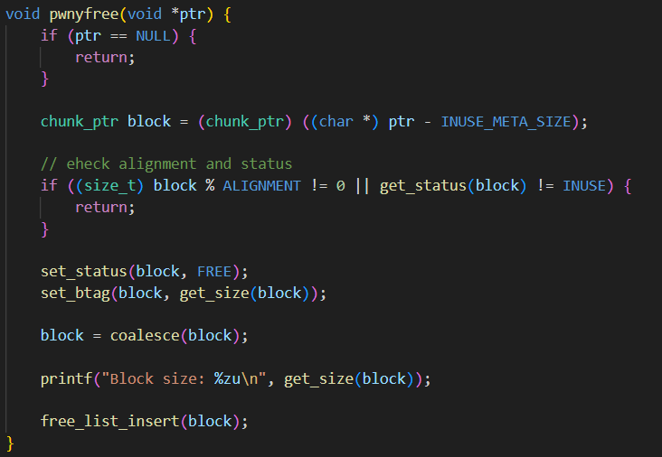
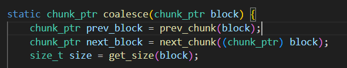
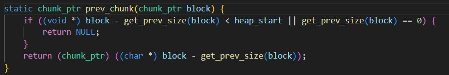
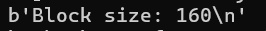

- Challenge này sẽ sử dụng heap tự tạo bao gồm malloc và free
- Tuy nhiên chỉ có 2 lựa chọn:
    - Tạo 1 `complaint` - điều này sẽ khiến chương trình malloc 1 chunk size `0x50`, cho chúng ta ghi vào sau đó free chunk này đi
    - Tạo 1 `request` - request sẽ được khởi tạo với chunk size `0x90` gồm 
        - `status`: nếu status = 1 thì chương trình sẽ in ra flag, mặc định khi khởi tạo sẽ gán = 0
        - `amount`: không ảnh hưởng đến flow của chương trình
        - `reason[0x80]`: vùng sẽ đọc input vào

- Cả 2 cách `complaint` hay `status` đều không có heap overflow. Bản thân `complaint` cũng memset về 0 sau khi free, chương trình cũng không quản lí heap theo cách thông thường

- Ở đây vài điểm mình ý ở hàm free:
    - 
    - Hàm free sẽ check align của block được free, nếu không align thì sẽ không free
    - Sau khi free block thì sẽ gộp với các block free liền trước và liền sau bằng hàm `coalesce`
    - 
    - Từ hàm `coalesce` có thể thấy chương trình sẽ lấy size của prev_chunk bằng get_prev_size
        - 
        - Tuy nhiên, get_prev_size sẽ trả về frame nằm ngay trên frame chứa size của chunk hiện tại

- Từ đó mình có thể giải quyết bài này bằng cách tạo sẵn 1 `request` với 8 byte cuối là size của fake_chunk, sau đó tiến hành `complaint` để fake_chunk được remove, tiếp tục fake 1 chunk nữa liền kề fake_chunk trước đó sẽ tạo thành 1 block có size là `0x50 * 2`
    - 
- Sau đó khi tiến hành `request` chương trình sẽ tìm và trả về fake_block mà mình đã setup ở bước trên, từ đó mình có thể ghi đè được `status` của 1 chunk ngay dưới vì lúc này số bytes có thể ghi đã vượt qua pivot của chunk ban đầu
    