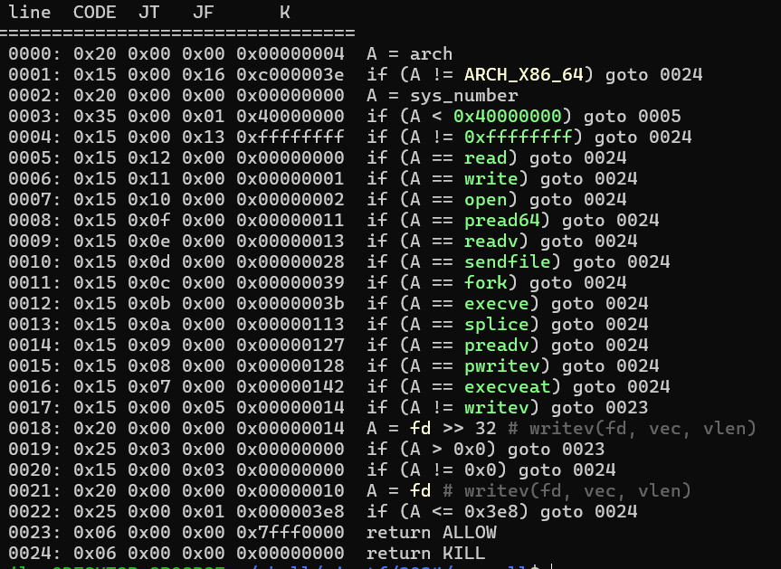
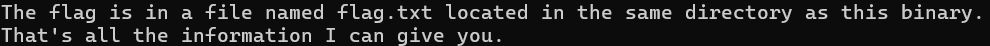

- Chương trình sẽ đọc vào shellcode của chúng ta sau đó thực thi với seccomp như bên dưới
    - 
    - Chương trình cũng cho biết thông tin về flag
    - 

- Có thể thấy hầu hết các hàm thông dụng để open, read, write đã bị kill, tuy nhiên vẫn còn:
    - Open: `openat(AT_FDCWD, "name", flag)` có thể mở file ở dir hiện tại
    - Read: `preadv2(fd, vec, vlen, offset, flag)` có thể đọc file từ fd
    - Write: `writev(fd, vec, vlen)` cho phép in ra stdout

- Với open và read không xảy ra vấn đề gì vì chương trình không chặn
- Với writev nếu fd < 32bit sẽ bị kill.
    - Tuy nhiên, fd mà writev syscall hiểu là int, do đó nếu higher bit của fd là gì thì cũng không ảnh hưởng đến fd mà writev đọc
    - Giả sử fd là `0x100000001` thì writev sẽ hiểu fd là `0x1`
    - Từ đó bypass được fd check của seccomp và có được flag